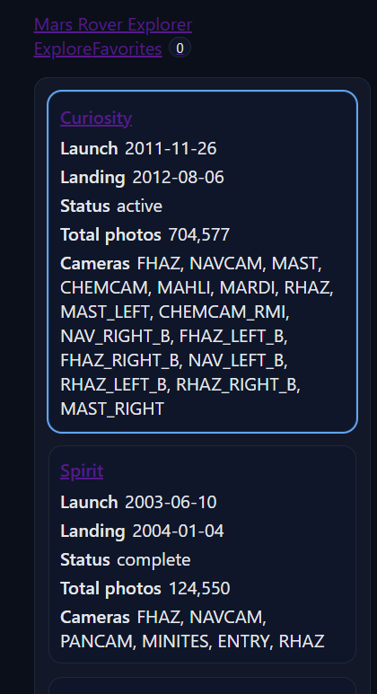
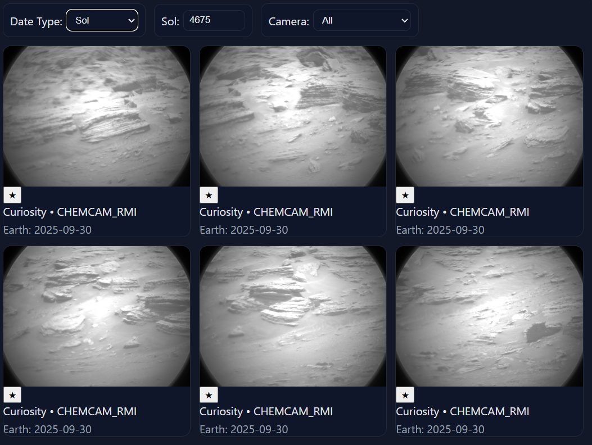
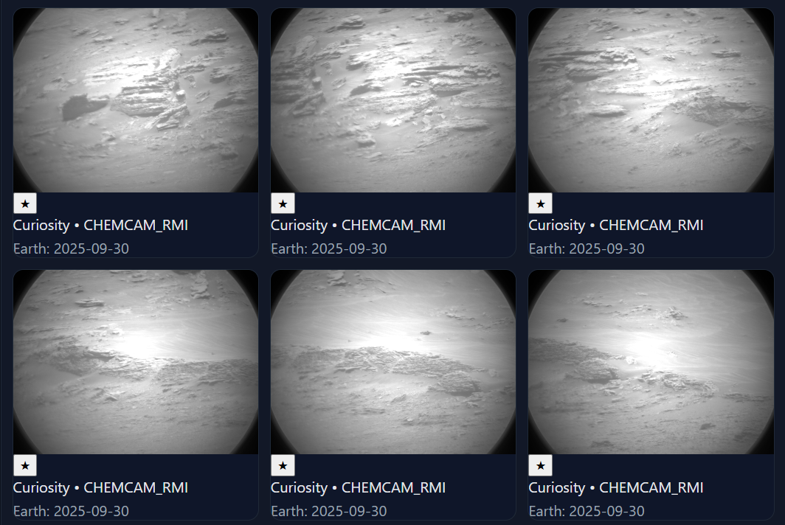
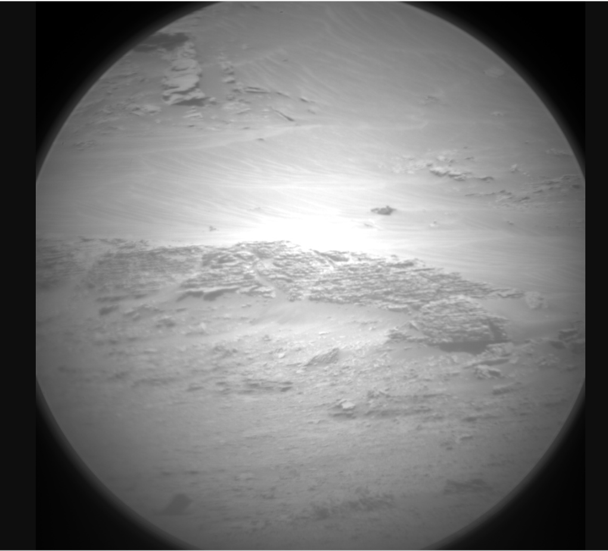

Mars Rover Photo Explorer (MERN)

A modern MERN app to explore photos from NASA’s Mars rovers. React (Vite) frontend, Node/Express proxy backend, and MongoDB for persistence.

🚀 Overview

Browse rovers with key metadata (launch/landing, status, cameras, total photos).

View rover photos by Earth date or Martian sol.

Filter by camera.

Pagination with “Load More” (+ light infinite scrolling).

Modal / lightbox with photo metadata.

Favorites saved to MongoDB (add/remove, badge count, Favorites page).

Responsive layout + basic a11y (keyboard close, alt text, semantic HTML).

Express server proxies the NASA API and adds in-memory caching + polite retry for rate limits.

🏗 Architecture

Frontend: React (Vite) • React Router • React Query

Backend: Express • Axios proxy • Mongoose

Database: MongoDB (local or Atlas) for favorites

Styling: Plain CSS (clean, modern)

mars-rover-explorer/
├── client/            # React frontend
├── server/            # Express backend + MongoDB
├── .github/workflows/ # CI (GitHub Actions)
├── docs/              # screenshots / demo
└── README.md

⚙️ Setup
Prereqs

Node.js 20+ (LTS recommended)

MongoDB running locally (or Atlas connection string)

Environment Variables

Create server/.env (don’t commit secrets):

PORT=5000
MONGODB_URI=mongodb://127.0.0.1:27017/mars_rover
NASA_API_BASE=https://api.nasa.gov/mars-photos/api/v1
NASA_API_KEY=YOUR_PERSONAL_KEY   # get one at https://api.nasa.gov
CLIENT_ORIGIN=http://localhost:5173
CACHE_TTL_MS=300000

You can use DEMO_KEY temporarily, but it hits rate limits quickly.

Create client/.env:

VITE_API_URL=http://localhost:5000/api

Install & Run

From the repo root:

# install deps for both apps
npm run install:all

# start server + client together
npm run dev

Client: http://localhost:5173

Server: http://localhost:5000/api

📱 Features

Core

Rovers list (+ launch/landing, status, cameras, total photos)

Select rover → fetch photos

Earth date / Sol switch

Camera filter

Pagination / Load More

Modal with metadata

Responsive & a11y basics

Persistence

Favorite/unfavorite photos

Favorites stored in MongoDB

Favorites page (/favorites) with remove

Proxy & Caching

Express proxy to NASA API

In-memory cache (TTL configurable)

Retry/backoff for 429/5xx

Friendly UI banner when NASA rate-limits

URLs / Shareable state

Rover/date/camera and selected photo ID are reflected in the URL (query params)

🧪 Testing & CI

Backend tests (Vitest + Supertest):

npm --prefix server run test

CI via GitHub Actions runs tests on every push/PR (.github/workflows/ci.yml).

🛠 Scripts

npm run install:all – install server + client

npm run dev – start both (concurrently)

npm --prefix server run start – start backend only (prod)

npm --prefix server run test – backend tests

🩹 Troubleshooting

403 from NASA: your NASA_API_KEY is missing/invalid. Use a personal key and restart the server.

429 rate limit: too many requests—slow down or switch dates; the server retries politely and caches responses.

Mongo connection refused: ensure MongoDB is running locally or set a valid Atlas MONGODB_URI.

Modal doesn’t open: ensure the URL gains ?photo=ID when clicking; Esc/backdrop click closes it.

📝 Decisions & Trade-offs

React Query for request state & caching (simple + reliable).

In-memory server cache instead of Redis for easy local setup.

Persistence limited to Favorites to satisfy the Mongo requirement cleanly.

Styling kept minimal (plain CSS) to focus on UX and functionality.

🔮 Future Work

Dark mode toggle.

Skeleton loaders & masonry grid.

Offline-first (service worker) and smarter client-side caching.

More tests (frontend hooks/components) and e2e.

Redis-backed cache and per-user auth for favorites.

📸 Screenshots

✅ Submission

Public GitHub repo with regular commits.

This README included.

Core user stories implemented; Mongo persistence demonstrated.