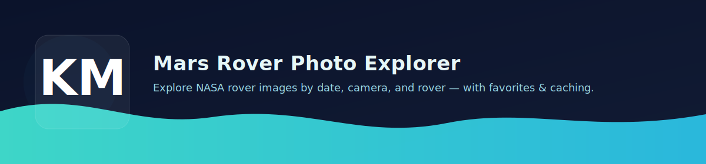

  

Mars Rover Photo Explorer (MERN)

  &nbsp;  &nbsp;  &nbsp;  

Explore Mars rover images via NASA’s public API with a smooth, modern UI.
Built as a focused MERN take-home to showcase product sense, data handling, and clean architecture.

Live Demo:

Client: https://mars-rover-explore.netlify.app

API: https://mars-rover-explorer.onrender.com
 → health: /api/health

✨ Highlights

Browse Rovers with key metadata (launch/landing dates, status, cameras, total photos).

Photo Explorer by Earth date or Sol, with camera filter.

Pagination & Infinite Scroll (so the page stays snappy).

Photo Modal (lightbox) with keyboard support (Esc to close) and metadata.

Favorites persisted in MongoDB (tiny UX badge + toggle).

Responsive & Accessible: semantic HTML, alt text, keyboard-navigable UI.

Server Proxy & Caching: Node/Express proxy to NASA, with in-memory TTL cache to reduce rate limits.

Deployed (Netlify + Render) with environment-based configuration.

🧭 Screenshots

Add or update these images under docs/ in your repo.

Rovers	Grid	Modal	Favorites

	
	
	
🧱 Architecture
mars-rover-explorer/
├─ client/               # React + Vite UI
│  ├─ src/
│  │  ├─ components/     # Header, RoverList, Controls, PhotoGrid, PhotoModal…
│  │  ├─ hooks/          # useRovers, usePhotos, useFavorites (React Query)
│  │  └─ api/            # axios client (reads VITE_API_URL)
│  └─ public/_redirects  # SPA fallback
├─ server/               # Express API proxy + MongoDB (Mongoose)
│  ├─ src/
│  │  ├─ routes/         # /api/rovers, /api/photos, /api/favorites
│  │  ├─ nasa.js         # thin client to NASA API
│  │  └─ cache.js        # TTL in-memory cache
│  └─ .env.example
├─ netlify.toml          # build config for client
└─ README.md

Client: React + React Router + React Query + axios
Server: Express + axios + Mongoose + CORS + morgan
DB: MongoDB (Atlas or local) – favorites collection
Styling: Modern CSS, dark theme, responsive layout

⚙️ Setup (Local)

Prereqs: Node 18+ (or 20), MongoDB (local or Atlas).

Install

npm run install:all          # installs client & server deps

Environment

Create server/.env (or copy from .env.example):

PORT=5000
MONGODB_URI=mongodb://127.0.0.1:27017/mars_rover   # or your Atlas SRV URI
NASA_API_BASE=https://api.nasa.gov/mars-photos/api/v1
NASA_API_KEY=YOUR_REAL_NASA_KEY
CLIENT_ORIGIN=http://localhost:5173
CACHE_TTL_MS=300000

Using Atlas? URL-encode special characters in your password
(# → %23, @ → %40, / → %2F, etc.).

Create client/.env:

VITE_API_URL=http://localhost:5000/api

Run dev (both apps)

npm run dev
# client: http://localhost:5173
# server: http://localhost:5000
# health: http://localhost:5000/api/health

🧪 Tests
npm --prefix server run test

Small vitest/supertest suite for the API (health, rovers, input validation).

🚀 Deployment
Client (Netlify)

netlify.toml at repo root:

[build]
  command = "npm --prefix client ci && npm --prefix client run build"
  publish = "client/dist"

[[redirects]]
  from = "/*"
  to = "/index.html"
  status = 200

Env var: VITE_API_URL=https://mars-rover-explorer.onrender.com/api

Server (Render)

Root Directory: server

Build: npm ci

Start: npm start

Env vars:

NODE_VERSION=20
MONGODB_URI=<your Atlas SRV URI>
NASA_API_BASE=https://api.nasa.gov/mars-photos/api/v1
NASA_API_KEY=<your key>
CLIENT_ORIGIN=https://mars-rover-explore.netlify.app
CACHE_TTL_MS=300000

Health: https://mars-rover-explorer.onrender.com/api/health

Note: Free Render instances “sleep”; the first request may take a few seconds to wake.

📚 API Overview (server)

GET /api/health → { ok: true }

GET /api/rovers → rover metadata (cached)

GET /api/photos?rover=<name>&earth_date=YYYY-MM-DD&page=1&camera=<optional>

or sol=<number> instead of earth_date

GET /api/favorites → list favorites

POST /api/favorites → { nasa_id, img_src, earth_date, sol, rover, camera }

DELETE /api/favorites/:nasa_id

🧠 Decisions & Trade-offs

React Query for caching/pagination simplicity.

Server-side cache (in-memory TTL) to mitigate NASA rate limits quickly.

Favorites chosen as the persistence feature (covers CRUD + UI feedback) to meet MERN requirement.

Plain CSS for speed and clarity; easy to swap to Tailwind/MUI.

Free-tier deploy (Render + Netlify) for quick demo; note cold starts.

🔮 Future Work

Dark/Light theme toggle

Masonry grid + skeleton loaders

Shareable deep links & URL state sync

More tests + GitHub Actions CI

Redis/Upstash for cache, image CDN, and offline hints

🙏 Attribution

Data from the NASA Mars Rover Photos API — https://api.nasa.gov/

Images © NASA/JPL-Caltech.

License

MIT © 2025

 Built by <strong>Keith Mazza</strong> — Mars Rover Photo Explorer  https://mars-rover-explore.netlify.app • https://mars-rover-explorer.onrender.com 

📸 Screenshots

